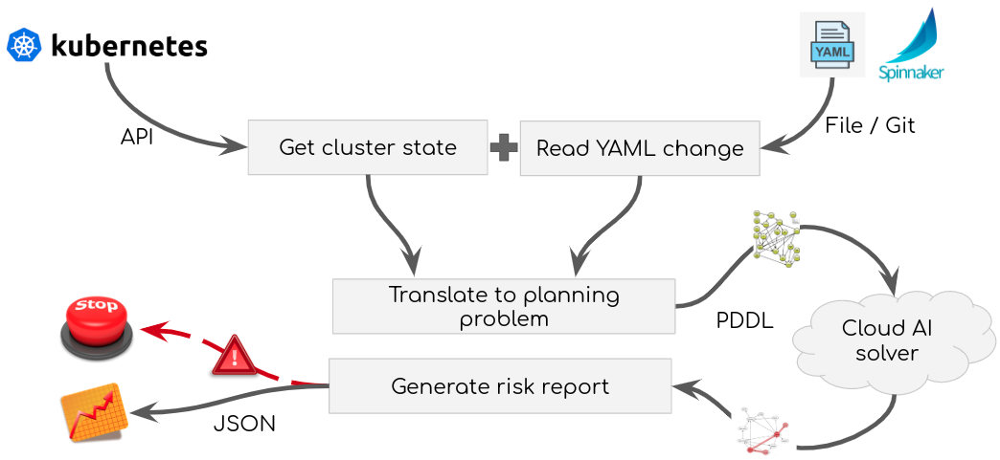

# kubectl-sim

[](https://opensource.org/licenses/Apache-2.0) [](https://badge.fury.io/py/kubectl-sim) [](https://travis-ci.org/criticalhop/kubectl-sim)

# Overview


`kubectl-sim` is a formal validator for whole kubernetes clusters' configurations using [AI planning](https://en.wikipedia.org/wiki/Automated_planning_and_scheduling). It is written in pure `Python` and translated to [PDDL](https://en.wikipedia.org/wiki/Planning_Domain_Definition_Language) using [poodle](https://github.com/criticalhop/poodle).

`kubectl-sim` implements a simplified kubernetes model using an object-oriented state machine and searches for any scenario that may lead to a 'failure'. Failures are currently defined as `Service` having no associated running pods. Other definitions are also possible and are currently work in progress. 

# Quick Start

## Requirements

kubectl-sim is written in modern Python and requires **Python 3.7+**, so please be prepared that if your default script installation  uses older Python versions you may have to manually specify the interpreter for the script.

## Installation

### Binary release

Easiest way is to use our binary release which auto-updates itself. You can [download latest release here](https://github.com/criticalhop/kubectl-sim/releases/latest/download/kubectl-sim), or you can execute these commands:

```shell
wget https://github.com/criticalhop/kubectl-sim/releases/latest/download/kubectl-sim 
chmod +x ./kubectl-sim
sudo ln -s $(pwd)/kubectl-sim /usr/local/bin/kubectl-sim
```

remember to mark the file executable by issuing `chmod +x ./kubectl-sim`
    
### PyPi release

    $ pip install kubectl-sim

`kubectl-sim` comes as a simple [kubectl plugin](https://kubernetes.io/docs/tasks/extend-kubectl/kubectl-plugins/), so a working `kubectl` is a requirement if you want to access real cluster. If you do not have `kubectl` you can use it just as standalone shell command `kubectl-sim` instead of `kubectl sim ...`

## Usage

### Checking if creating a resource won't break anything

To try it against sample "broken" kubernetes configurations, use `-d` option to supply a folder with a collection of Kubernetes resources' stored from `kubectl get <...> -o=yaml > <...>.yaml`, and try to create a new resource with `-f`, e.g.:

    $ git clone https://github.com/criticalhop/kubectl-sim
    $ cd kubectl-sim/examples/daemonset-eviction
    $ kubectl sim -d cluster-dump/ -f daemonset_create.yaml
    
You can find a bigger cluster example in tests/ folder.
    
### Checking a Kubernetes configuration for correctness

Invoking `kubectl sim` without `-f` will run a check of current configuration and (hopefully) find no issues, as the configuration is already running. 

    $ kubectl sim -d cluster-dump/

### Checking live cluster

Before checking the cluster you should first "dump" all of current resources into a "cluster dump" folder:

```shell
mkdir my-cluster-dump
cd my-cluster-dump
kubectl get nodes --all-namespaces -o=yaml > nodes.yaml
kubectl get pods --all-namespaces -o=yaml > pods.yaml
kubectl get services --all-namespaces -o=yaml > services.yaml
kubectl get priorityclass --all-namespaces -o=yaml > priority.yaml
```

After you have the dump folder, you can continue with a check described above.

### Excluding a Scenario

There may be more than one issue with the configuration and `kubectl-sim` will only detect one scenario at a time. To select next scenario it is possible to exclude certain resources from search by issuing `-e Service:<service-name>` command:

```shell
kubectl-sim -d ... -f ... -e Service:redis-master
```

so if `kubectl-sim` detects a scenario with a kind `Service` and name `redis-master` this command would exclude it from search and you will either get the next scenario, if any - or a clean cluster state as a result.

# Architecture

To search for a failure scenario, kubectl-sim builds a model representation of the current cluster state that it reads from the files created by `kubectl get -o=yaml`. The constructed model is sent to PDDL planner and the resulting solution is then interpreted as a failure scenario and sent back to console as YAML-encoded scenario steps.

Scenario output can later be used by the pipeline operator to aid with decision making - e.g. whether stop the deployment, log the event to the dashboard, etc.

`kubectl-sim` also calculates the probability of the scenario by multiplying the probability associated with every step.



`kubectl-sim` depends on a configured PDDL AI-planning `poodlesolver` running as http service. By default it uses a cloud solver hosted by [CriticalHop](https://www.criticalhop.com/). `poodlesolver` comes with `poodle` python library and installs automatically when `kubectl-sim` is installed via `pip install`. To run a local solver, please refer to [poodle documentation](https://github.com/criticalhop/poodle). 

# Build from source

```shell
git clone https://github.com/criticalhop/kubectl-sim
cd kubectl-sim
poetry install
```

# Specifying solver location

By default `kubectl-sim` uses a hosted solver. You can learn how to run you local solver by checking [poodle](https://github.com/criticalhop/poodle) repository.

# Vision

The goal for the project is to create an intent-driven, self-healing Kubernetes configuration system that will abstract the cluster manager from error-prone manual tweaking.

# Project Status

`kubectl-sim` is a developer preview and currently supports a subset of resource/limits validation and partial label match validation.

We invite you to follow [@criticalhop](https://twitter.com/criticalhop) on [Twitter](https://twitter.com/criticalhop) and to chat with the team at [#kubectl-sim](https://tinyurl.com/y5s98dw6) on [freenode](https://freenode.net/). If you have any questions or suggestions - feel free to open a [github issue](https://github.com/criticalhop/kubectl-sim/issues) or contact andrew@criticalhop.com directly.

For enterprise enquiries, use the form on CriticalHop website: [criticalhop.com/demo](https://www.criticalhop.com/demo) or write us an email at info@criticalhop.com
